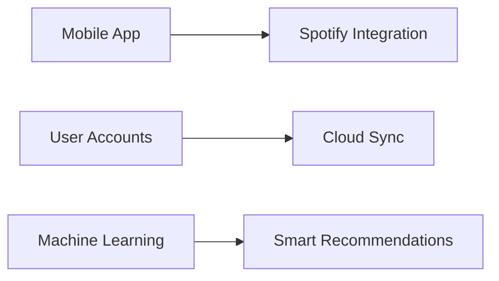

Here's a beautifully formatted version of your `WeatherMoodify` project documentation:

---

# 🌤️ WeatherMoodify 🎶  
**Your Personal Mood & Weather Playlist Generator**  

![Header Image][ (https://via.placeholder.com/800x200/4a6fa5/ffffff?text=WeatherMoodify+%F0%9F%8E%B6%E2%98%81%EF%B8%8F](https://www.google.com/url?sa=i&url=https%3A%2F%2Ftempest.earth%2Fresources%2Fdoes-the-weather-affect-your-mood%2F&psig=AOvVaw14zX9R1slcQrwzwgOYFAOz&ust=1750015667266000&source=images&cd=vfe&opi=89978449&ved=0CBQQjRxqFwoTCPjdkcPS8Y0DFQAAAAAdAAAAABAE)  


## ✨ Features  

| Category          | Features                                                                 | Emoji |
|-------------------|--------------------------------------------------------------------------|-------|
| **Weather Integration** | Live scraping of current conditions (sunny, rainy, etc.) from Google Search | 🌍🔍 |
| **Mood Detection** | Advanced NLP sentiment analysis + emoji interpretation | 🤖🧠 |
| **Music Curation** | 100+ pre-loaded playlists matching 36 mood-weather combinations | 🎼📊 |
| **Beautiful GUI** | Intuitive Tkinter interface with modern styling | 🖥️🎨 |
| **Export Options** | Copy to clipboard or save as text file with one click | 📋📁 |

---

## 🛠️ Installation  

### Requirements  
- Python 3.7+  
- pip package manager  

### Steps  
```bash
# Clone repository
git clone https://github.com/yourusername/WeatherMoodify.git
cd WeatherMoodify

# Install dependencies
pip install -r requirements.txt

# Download NLTK data (run in Python shell)
import nltk
nltk.download('vader_lexicon')
```

---

## 🚀 Quick Start Guide  

1. **Launch the App**  
   ```bash
   python main_gui.py
   ```

2. **Enter Your Details**  
   - 🌆 City name (e.g., "Paris")  
   - 😊 Mood (text or emoji like "happy" or "😎")  

3. **Get Your Playlist**  
   - See 10-15 personalized song recommendations  
   - 🔄 Click "Regenerate" for new suggestions  
   - 📋 Copy or 💾 Save your playlist  

---

## 🗂️ Project Structure  

```
WeatherMoodify/
├── core/
│   ├── mood_detector.py       # Mood analysis logic
│   ├── weather_scraper.py     # Live weather data
│   └── playlist_manager.py    # Music recommendation engine
├── data/
│   └── playlist_db.json       # Customizable playlists
├── assets/                    # GUI images/icons
├── main_gui.py                # Main application
└── requirements.txt           # Dependencies
```

---

## 🎨 Customization  

### 1. Add Custom Playlists  
Edit `data/playlist_db.json`:  
```json
{
  "sunny": {
    "happy": ["Song 1", "Song 2", ...],
    "sad": [...]
  }
}
```

### 2. Expand Mood Categories  
Modify `mood_detector.py` to add:  
- New emoji mappings  
- Custom sentiment thresholds  

---

## ⚠️ Troubleshooting  

| Issue | Solution |
|-------|----------|
| Weather data fails | 1. Check internet connection<br>2. Update CSS selectors in `weather_scraper.py` |
| NLTK errors | Run `nltk.download('vader_lexicon')` |
| GUI freezing | Use smaller playlist sets or add loading animations |

---

## 🌟 Future Roadmap  



---

**📝 License:** MIT  
**🐛 Report Issues:** [GitHub Issues](https://github.com/yourusername/WeatherMoodify/issues)  
**📬 Contact:** developer@example.com  

---

 

